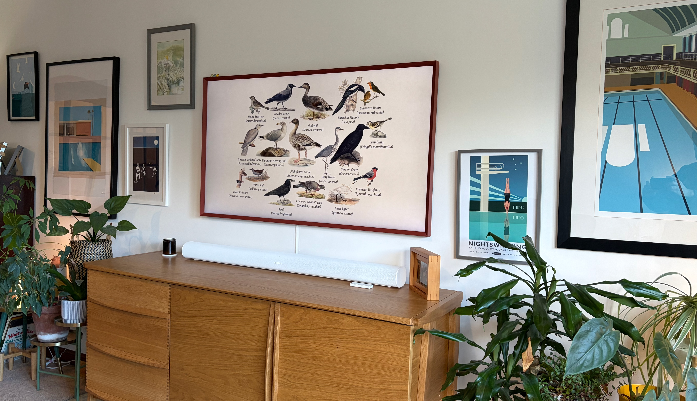
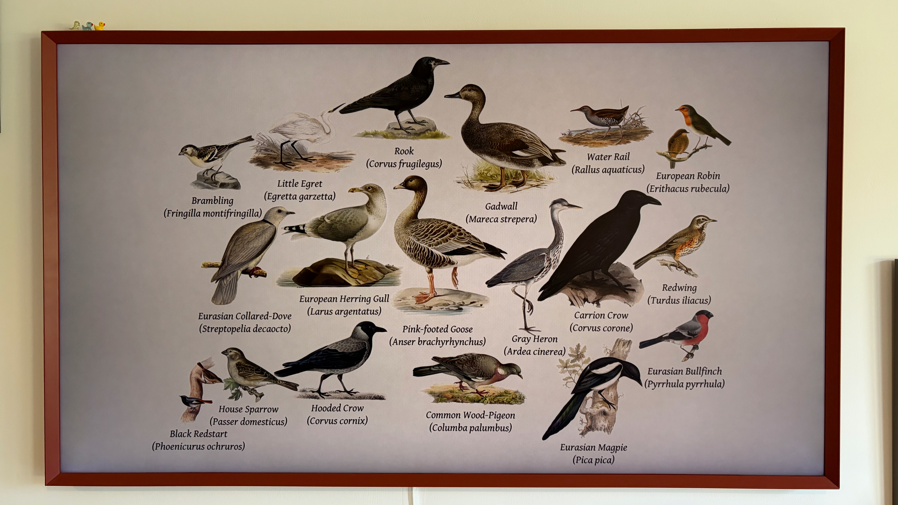

# Birds on your Samsung Frame

Show your local birdlife on your TV, using the collages from
[Fugleramme](https://github.com/arnegiacomo/fugleramme).
New collages are checked every 15 minutes and sent when the TV is already in
Art Mode. The script sends no power or mode-switching commands.



## What you need

- Fugleramme already running and showing your bird collages.
- A Samsung Frame TV with a compatible Art API, reachable from that machine.
If Fugleramme runs in Docker, run this setup on the **host machine** and use
its published Fugleramme port.

## Set it up

1. Download the `frame-sync-<version>.zip` asset from the
   [latest release](https://github.com/conradj/fugleramme-samsung-frame/releases/latest)
   onto your Fugleramme machine. Extract it with
   `unzip frame-sync-<version>.zip`, replacing `<version>` with the download's
   version. Use the release asset, not GitHub's automatically generated source ZIP.
2. Run the installer from the extracted `frame-sync-<version>` folder:

   ```bash
   sudo python3 setup.py
   ```

3. Enter your **TV's IP address** and **Fugleramme URL** when asked.
   If Fugleramme is on this machine at port 8080, press Enter to accept the URL.
   You can also reuse an existing TV pairing token if you have one.
4. Put the TV in **Art Mode**, accept any **FrameSync** permission prompt,
   and confirm that the collage appeared.

Setup installs the dependencies and service, tests the connection, and turns
on automatic updates after you confirm the picture. If pairing times out,
accept the TV prompt and retry when asked.

That's it. The machine checks for new collages automatically, including after
it restarts. If the TV is unavailable, the next scheduled check tries again.



## Everyday commands

```bash
# Check for a new collage now
sudo systemctl start frame-sync.service

# See what happened
sudo journalctl -u frame-sync.service -n 20 --no-pager

# Stop automatic updates
sudo systemctl disable --now frame-sync.timer

# Resume automatic updates
sudo systemctl enable --now frame-sync.timer
```

To update, download the newer release ZIP, extract it into a fresh folder, and
run `sudo python3 setup.py` from that folder. The installed settings, saved
pairing token and sync history live in `/etc/frame-sync.env` and
`/var/lib/frame-sync`, outside the extracted folder. Setup pauses automatic
checks during installation; confirm the picture to resume them.

## Need help or a different setup?

See the [technical guide](docs/advanced.md) for pairing problems, settings,
manual installation, changing the interval and running without systemd.
To change an address after setup, edit `/etc/frame-sync.env` with
`sudoedit /etc/frame-sync.env`. See the guide before switching to a different TV.

## From the author

This started as a personal project to bring local birdlife onto the TV.
Read the [original author's note](docs/author-note.md), including the image
sizing workaround used for the Frame.

## Development

Clone the repository or download GitHub's source ZIP for development. The
release ZIP is the smaller, installable distribution.

Run the offline tests with `python3 -m unittest discover -s tests -v`.
Keep filled-in configuration, pairing tokens and runtime files out of Git.
